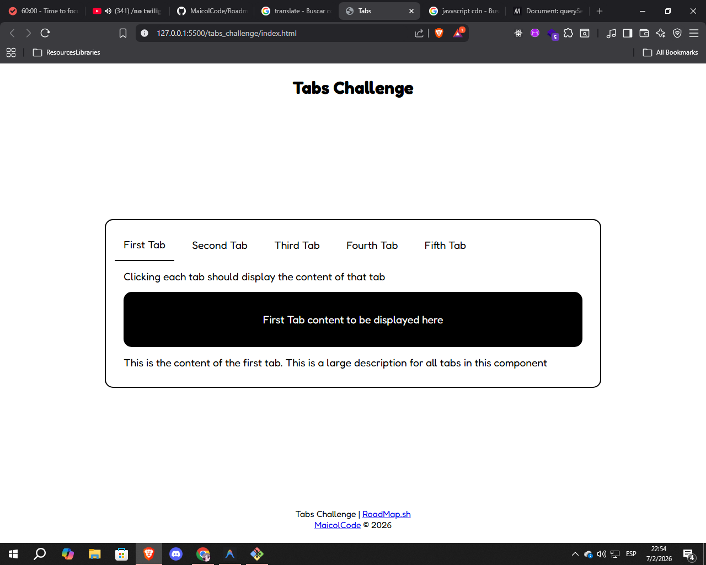

# Tabs
Crear un componente de pestañas que muestre el contenido de cada pestaña al hacer clic en ella.

## Tecnologías
- HTML
- CSS
- JavaScript

## Descripción
Esta proyecto es una introducción basica a la manipulación del DOM y a la asignación de eventos.

Se requiere la creación de un componente de pestañas que muestre el contenido de cada pestaña al hacer clic en ella haciendo uso de HTML, CSS y JavaScript basico. 

## Tareas

- [x] La página debe contener cinco pestañas.
- [x] La primera pestaña debe de estar activa por defecto.
- [x] Al hacer clic en una pestaña, debe de mostrarse el contenido de esa pestaña y el contenido actual debe de desaparecer.

## Objetivo 
El objetivo de este proyecto es practicar la manipulación del DOM y la asignación de eventos, para mostrar o esconder el contenido de cada pestaña.

## Resultado


## Uso
Para el uso de este proyecto primero debes de hacer un clon del repositorio, puedes hacerlo con el siguiente comando:
```bash
$ git clone https://github.com/MaicolCode/RoadmapshProjectsFront.git
```

Luego de clonar el repositorio, puedes abrir el archivo `index.html` con tu navegador para ver el resultado.

## URL del proyecto
https://roadmap.sh/projects/simple-tabs